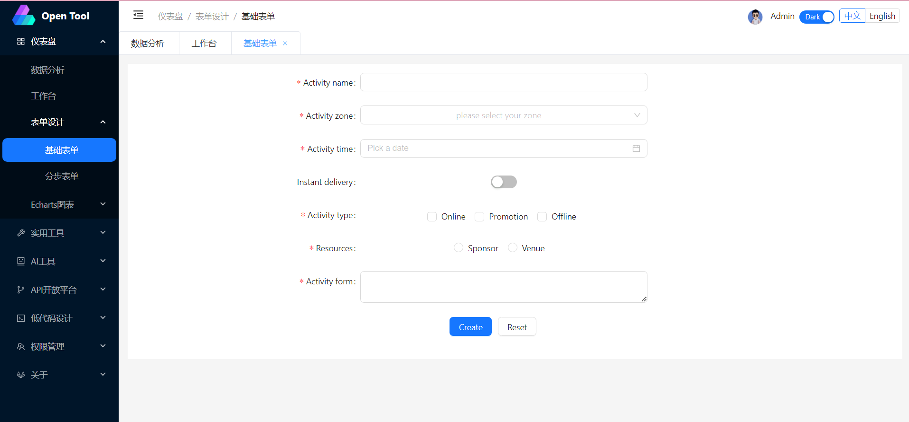
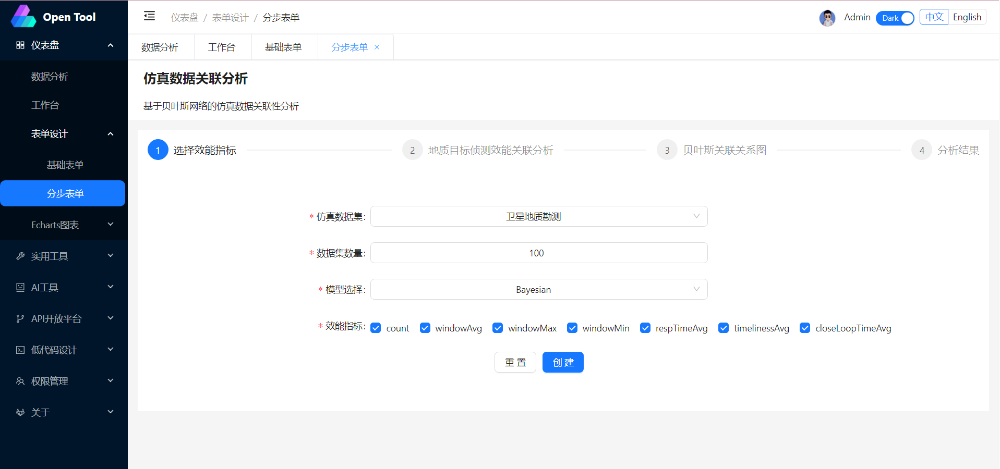
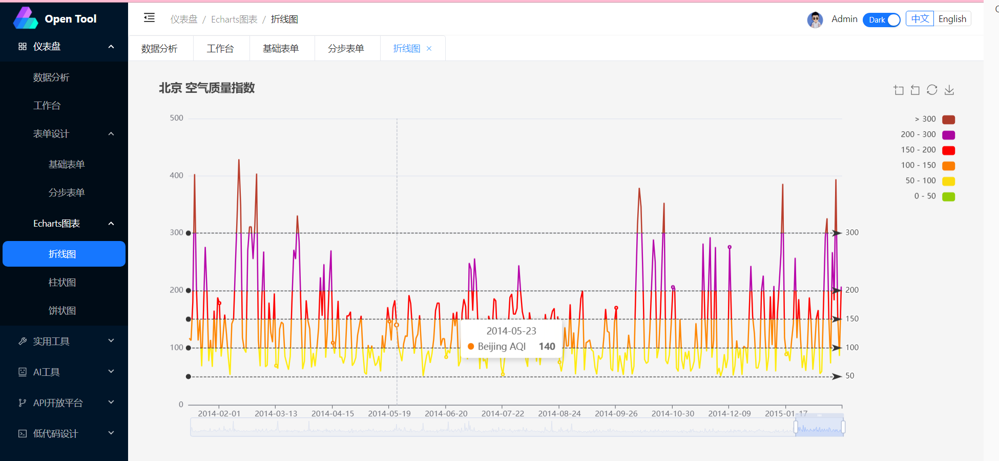
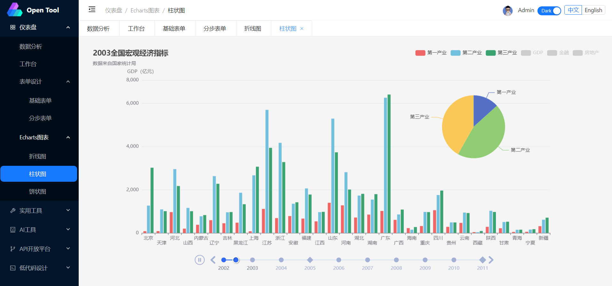
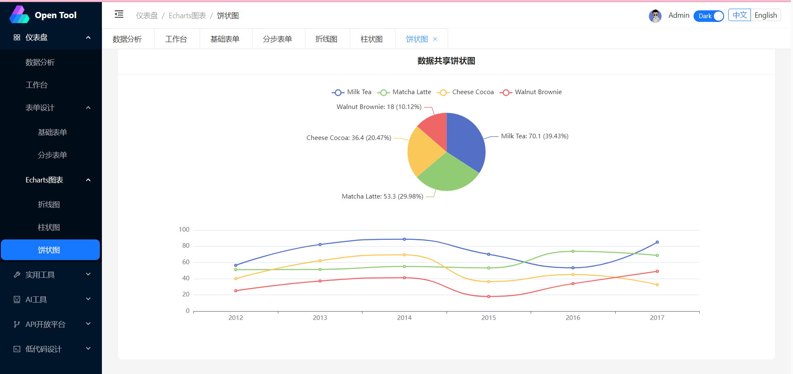
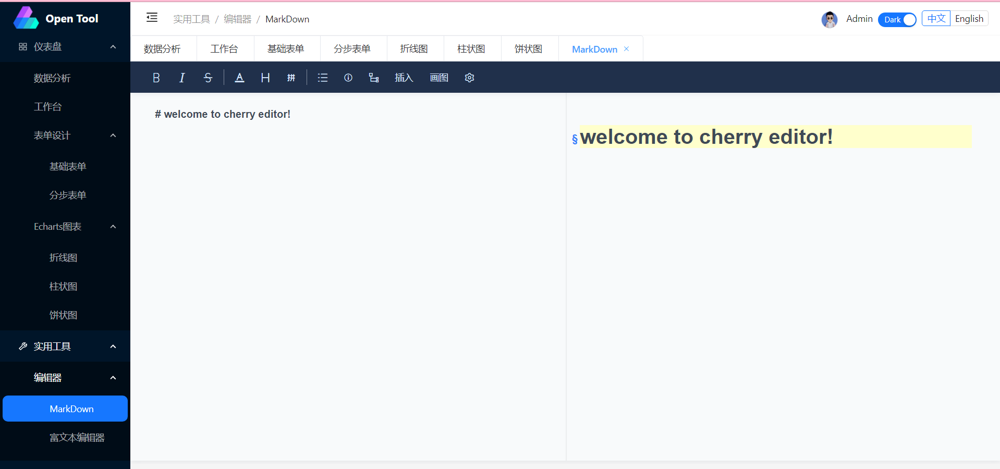
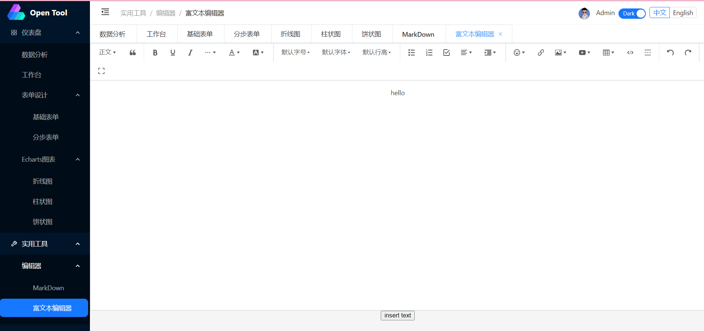

# Open-Tool

This template should help get you started developing with Vue 3 in Vite.

## Recommended IDE Setup

[VSCode](https://code.visualstudio.com/) + [Volar](https://marketplace.visualstudio.com/items?itemName=Vue.volar) (and disable Vetur) + [TypeScript Vue Plugin (Volar)](https://marketplace.visualstudio.com/items?itemName=Vue.vscode-typescript-vue-plugin).

## Customize configuration

See [Vite Configuration Reference](https://vitejs.dev/config/).

## Project Setup

```sh
npm install
```

### Compile and Hot-Reload for Development

```sh
npm run dev
```

### Compile and Minify for Production

```sh
npm run build
```

### Lint with [ESLint](https://eslint.org/)

```sh
npm run lint
```

## 界面展示

### 仪表盘

#### 数据分析


#### 工作台


#### 表单设计

##### 基础表单



##### 分布表单



#### Echarts图表

##### 折线图



##### 柱状图



饼状图




### 实用工具

#### 编辑器

##### MarkDown



#### 富文本编辑器



### 更多

正在开发中....，欢迎感兴趣的uu们加入.
